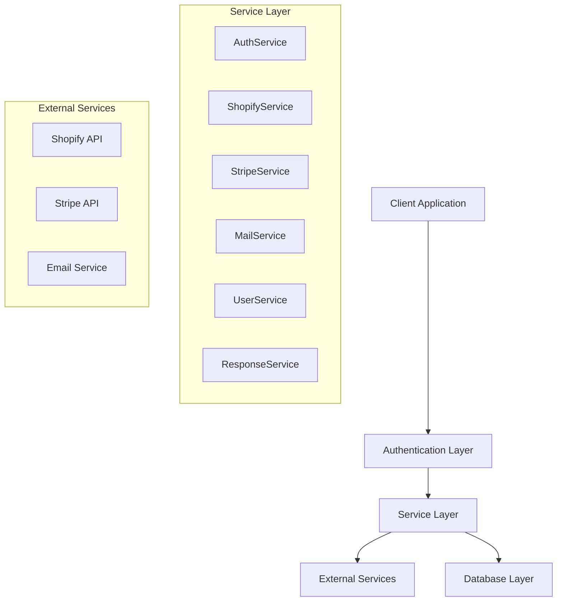
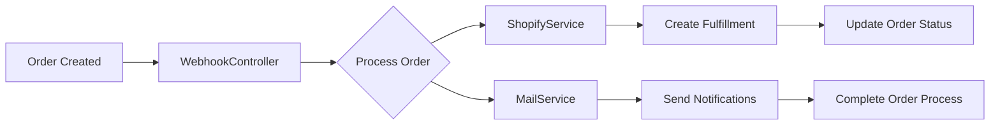
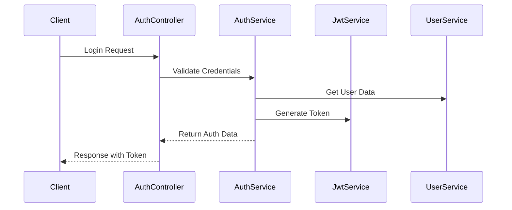

# Alcpay Documentation

Alcpay is a platform for managing orders, payments, and fulfillment for Shopify stores selling alcohol.

Alcpay's customers are alochol brands.  The brand can connect a shopify store to Alcpay.  The brand can then create a routing rule to route orders to a fulfillment service.  The brand can also create a payment gateway to process payments.

## Service Summary

| Service | Primary Responsibilities | Key Integrations |
|---------|------------------------|------------------|
| AuthService | User authentication, Session management | BCrypt, JWT |
| ShopifyService | E-commerce operations, Order management | Shopify API |
| StripeService | Payment processing, Account management | Stripe API |
| MailService | Email notifications, Communication | Email Provider |
| UserService | User management, Profile handling | Database |
| ResponseService | API response standardization | All Services |

## Core Services Chart

The core services chart is as follows:

### Key Services

#### 1. Authentication Services

**AuthService**

- Handles user authentication and authorization
- Manages JWT token generation and validation 
- Integrates with BCrypt for password handling

Key functions:

- Login
- Logout
- Token validation

#### 2. E-commerce Integration Services

**ShopifyService**

- Manages Shopify store integration
- Handles product synchronization
- Processes orders and fulfillment

Key features:

- Store configuration
- Order management
- Location management
- Fulfillment processing

#### 3. Payment Services

**StripeService**

- Manages payment processing
- Handles account creation and linking
- Processes transactions and payouts

#### 4. Communication Services

**MailService**

- Handles email notifications
- Manages email templates
- Sends order confirmations and alerts

#### 5. Utility Services

**ResponseService**

- Standardizes API responses
- Handles error formatting

**BCryptService**

- Manages password encryption
- Handles password validation

**JwtService**

- Manages JWT token operations
- Handles token generation and validation

## Dataflow for Order Processing

The dataflow for order processing is as follows:

## Services Interactions

The interactions between the services are as follows:

