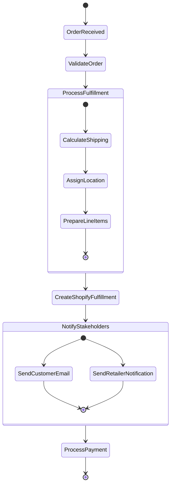
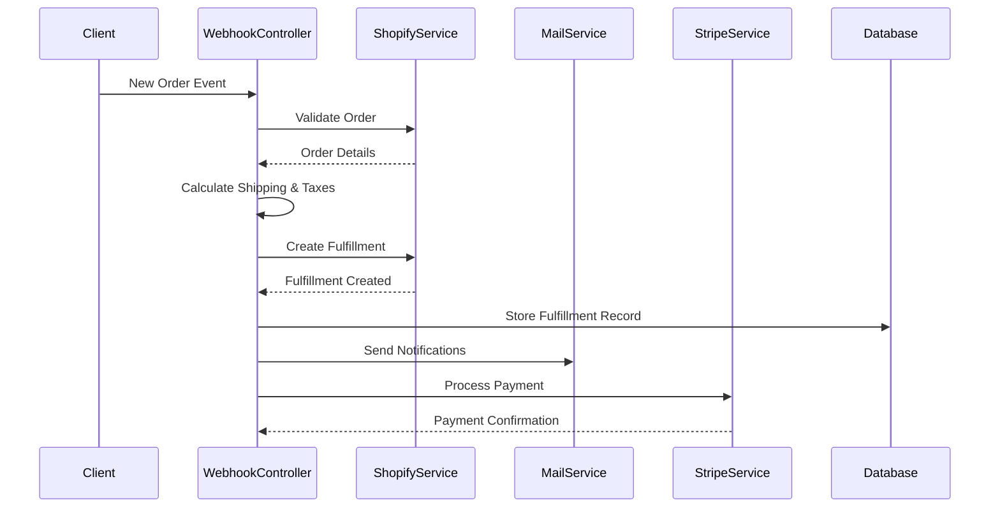

# Order Processing

Alcpay processes orders from Shopify stores.  The detailed order processing flow is described below.

## Order Processing Diagrams

The following diagrams and steps describe the order processing flow.

### Order Lifecycle

The order lifecycle is as follows:

### Detailed Order Processing Steps

The detailed order processing steps are as follows:

