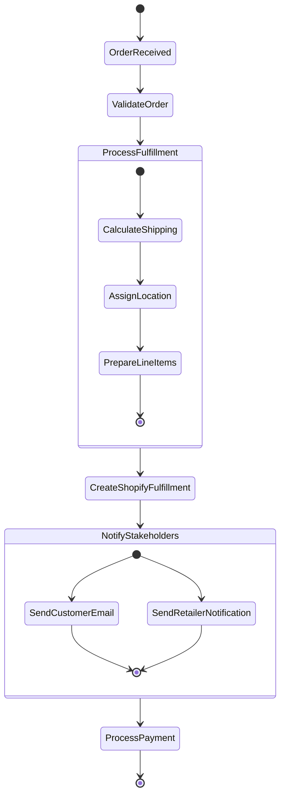
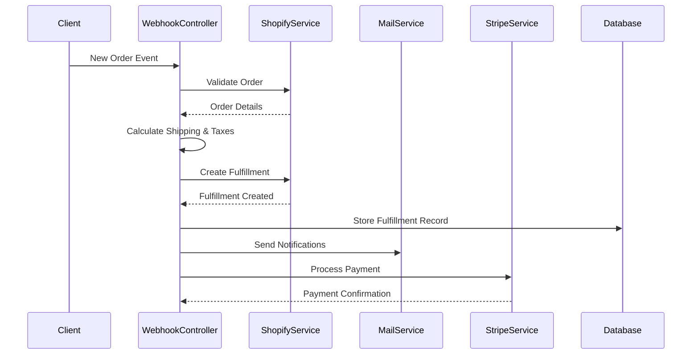
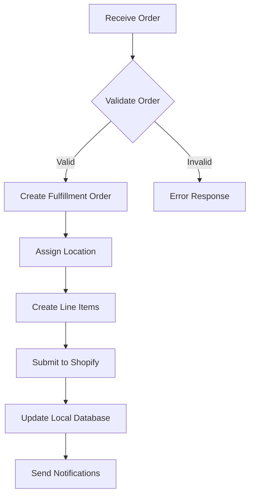
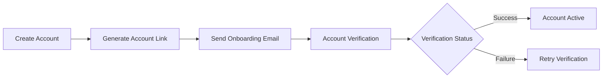

# Alcpay System - Integration & Order Processing Documentation

## Order Processing Flow

### 1. Order Lifecycle



### 2. Detailed Order Processing Steps



## Shopify Integration

### 1. Configuration

```js
const ShopifyConfiguration = {
    API_VERSION: '2023-01',
    ENDPOINTS: {
        FULFILLMENT: '/admin/api/${API_VERSION}/fulfillments.json',
        ORDERS: '/admin/api/${API_VERSION}/orders.json',
        LOCATIONS: '/admin/api/${API_VERSION}/locations.json'
    },
    WEBHOOKS: {
        ORDER_CREATED: '/webhook/order',
        FULFILLMENT_UPDATED: '/webhook/fulfillment-update'
    }
}
```

### 2. Key Integration Points

| Feature              | Endpoint                       | Description                          |
|----------------------|--------------------------------|--------------------------------------|
| Order Creation       | `/webhook/order`               | Receives new order notifications     |
| Fulfillment Creation | `/fulfillments.json`           | Creates fulfillment in Shopify       |
| Location Management  | `/locations.json`              | Manages store locations              |
| Tracking Updates     | `/fulfillment/trackingdetail`  | Updates tracking information         |

### 3. Fulfillment Process



## Stripe Integration

### 1. Account Management



### 2. Payment Processing Flow

| Stage                 | Handler                               | Description                          |
|-----------------------|---------------------------------------|--------------------------------------|
| Account Creation      | `StripeController.createAccount`       | Creates Stripe Express account        |
| Account Link          | `StripeController.createAccountLink`   | Generates onboarding link            |
| Payment Transfer      | `StripeService.transferFunds`          | Processes payment to retailer         |
| Account Verification  | `StripeController.refreshLink`         | Handles verification process          |

### 3. Implementation Details

```js
// Stripe Account Creation
const createStripeAccount = async (businessData) => {
    const account = await stripe.account.create({
        country: 'US',
        type: 'express',
        requested_capabilities: ['card_payments', 'transfers']
    });

    // Create account link for onboarding
    const accountLinkInfo = await stripe.accountLinks.create({
        account: account.id,
        refresh_url: `${process.env.STRIPE_REFRESH_HOST}/stripe/refresh-link/${account.id}`,
        return_url: `${process.env.WEB_HOST}/stripe-success/${account.id}`,
        type: 'account_onboarding'
    });

    return { account, accountLinkInfo };
};

// Payment Transfer
const transferFunds = async (accountId, amount, metaInfo) => {
    return await stripe.transfers.create({
        amount: parseInt(amount) * 100,
        currency: 'usd',
        destination: accountId
    });
};
```

## Error Handling and Monitoring

### 1. Error Response Structure

```json
{
    "status": "error",
    "code": "ERROR_CODE",
    "message": "Error description",
    "details": {
        "source": "Service name",
        "timestamp": "ISO_DATE",
        "reference": "Error reference"
    }
}
```

### 2. Key Error Scenarios

| Scenario                     | Handler             | Recovery Action                         |
|-----------------------------|---------------------|-----------------------------------------|
| Shopify API Failure         | WebhookController  | Retry with exponential backoff          |
| Stripe Transfer Failed      | StripeService      | Queue for retry, notify admin           |
| Invalid Order Data          | OrderValidation    | Log error, notify support               |
| Fulfillment Creation Failed | ShopifyService     | Retry with different location           |

Would you like me to expand on any particular aspect of the documentation or add additional sections?
